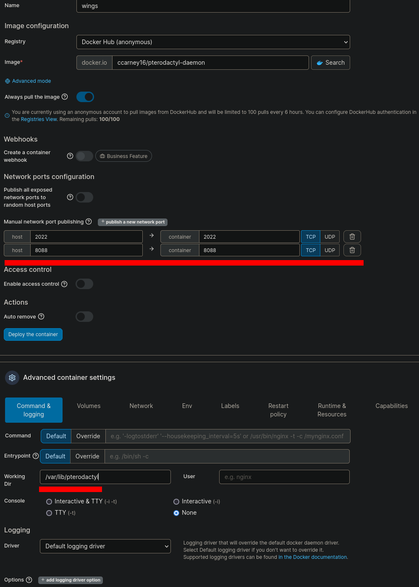

# wings on home assistant os with portainer
todo scratch for final doc

image: ccarney16/pterodactyl-daemon

ports: 2022 8088\
can be diferent but must mach everywhere

working dir: /var/lib/pterodactyl

volumes tab: all binds\
/var/run/docker.sock -> /var/run/docker.sock
\
/mnt/data/supervisor/share -> /mnt/data/supervisor/share
\
/etc/pterodactyl/config.yml -> /mnt/data/supervisor/share/addons_config/pterodactyl/config.yml
\
you can place the configfile elsewhere ofcourse

## runtime tab turn on privileged mode

## if you want it to start automaticly choose unless stopped on restart policy tab

after you create the config you have to modify the path in it
